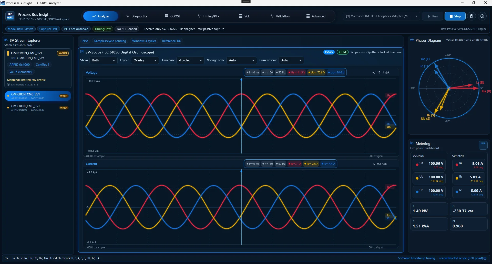
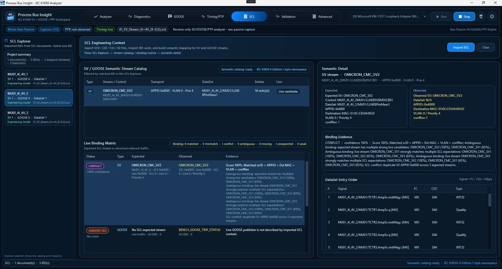
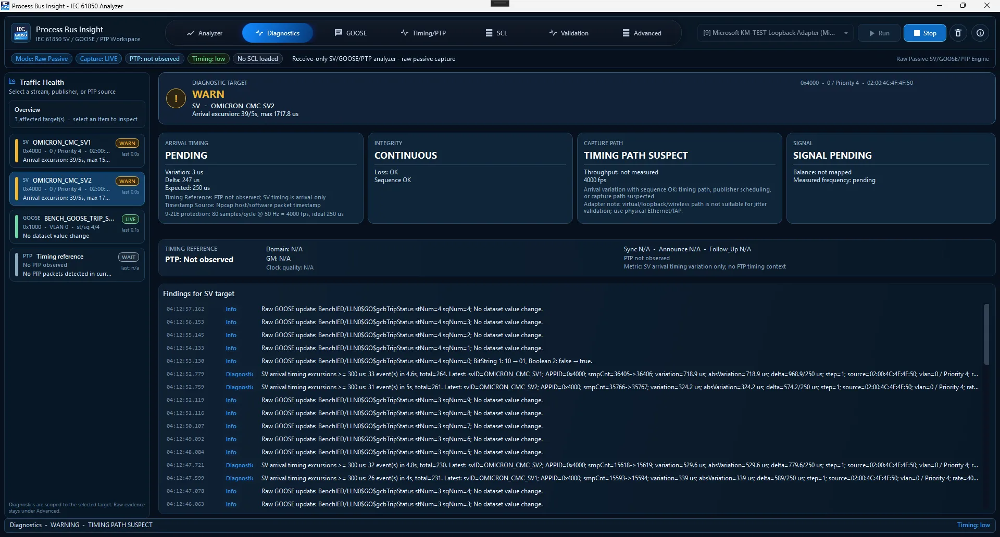
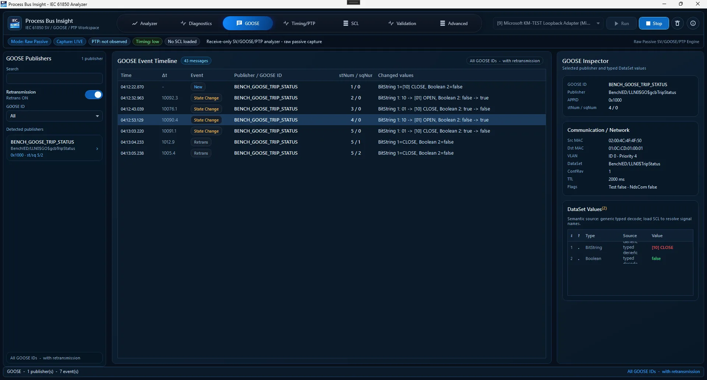

# Process Bus Insight (DigSubAnalyzer) — IEC 61850 SV, GOOSE & PTP Analyzer for Windows

[](https://github.com/masarray/DigSubAnalyzer/actions/workflows/ci.yml)
[](https://github.com/masarray/DigSubAnalyzer/actions/workflows/pages.yml)
[](https://github.com/masarray/DigSubAnalyzer/actions/workflows/release-package.yml)
[](https://github.com/masarray/DigSubAnalyzer/releases)
[](LICENSE)
[](#download--install--run)
[](#build-from-source)

**Process Bus Insight** is a free, open-source **IEC 61850 Process Bus analyzer** for Windows. It gives substation automation engineers a raw-passive view of **Sampled Values (SV)**, **GOOSE**, **PTP timing context**, and **SCL expected-vs-observed validation** during FAT, SAT, commissioning, interoperability checks, and troubleshooting.

It is built for field clarity: see what traffic is present, which stream or publisher is unhealthy, what the SCL file expects, and what evidence can be copied into an engineering finding. No subscription. No license key. Apache-2.0 source license.

> Timing note: arrival timing shown by the app is software/Npcap timestamp based. It is useful for screening and troubleshooting, not certification-grade jitter proof unless validated with suitable hardware timestamping, TAP, or trusted timing equipment.



## What is this?

Process Bus Insight is a receive-only Windows desktop instrument for IEC 61850 Process Bus visibility. It listens to raw Ethernet traffic through Npcap and presents engineering-level information instead of leaving the user with packet lists only.

The current product scope focuses on:

- IEC 61850-9-2 / Sampled Values stream discovery and diagnostics.
- IEC 61850 GOOSE publisher discovery, sequence tracking, and typed value inspection.
- PTPv2 visibility for timing context and confidence wording.
- SCL-assisted comparison between expected engineering configuration and observed network traffic.
- Evidence-oriented views that support FAT/SAT troubleshooting discussions.

## Why use it?

Wireshark is powerful, but commissioning work often needs faster answers:

- Which SV stream is live?
- Is the APPID, VLAN, MAC, svID, or confRev what the SCL says it should be?
- Which GOOSE publisher changed state?
- Is the issue in a stream, a publisher, a PTP source, or the capture path?
- What can be copied into an engineering finding without overclaiming timing accuracy?

Process Bus Insight is designed around those questions.

## Features

| Area | What you get |
| --- | --- |
| SV analyzer | Stream discovery, APPID/svID/source metadata, RMS/phasor visualization, reconstructed waveform, continuity counters, missing-sample indicators, arrival timing evidence. |
| GOOSE inspector | Passive publisher discovery, stNum/sqNum visibility, event timeline, typed value decoding, changed-value summary, publisher-focused inspection. |
| PTP visibility | Passive PTPv2 context for Ethernet and UDP transport, message timeline, grandmaster/domain context where available, timing-confidence wording. |
| SCL validation | Load SCD/ICD/CID files, compare expected streams/publishers with observed network evidence, surface matched, missing, unexpected, weak, mismatched, and conflicted status. |
| Evidence workflow | Copyable evidence text, cautious timing labels, target-aware diagnostics, and practical troubleshooting context for FAT/SAT. |
| Open source | Free to use, Apache-2.0 source license, no license server, no subscription, no hidden commercial gate. |

## Screenshots

| Analyzer overview | SCL binding workspace |
| --- | --- |
|  |  |

| Diagnostics | GOOSE inspector |
| --- | --- |
|  |  |

## Quick start

1. Install **Npcap** on the Windows machine that will capture Process Bus traffic.
2. Download the latest portable package from [GitHub Releases](https://github.com/masarray/DigSubAnalyzer/releases).
3. Extract the ZIP to a local folder such as `C:\Tools\ProcessBusInsight`.
4. Run `ProcessBusInsight.exe`.
5. Select a real Ethernet adapter connected to the Process Bus network or TAP.
6. Start capture and review SV, GOOSE, PTP, diagnostics, and SCL binding views.

For a field-oriented checklist, see [`docs/QUICK_START.md`](docs/QUICK_START.md).

## Download / Install / Run

The recommended user package is the **Windows x64 portable ZIP** created by the release workflow:

```text
ProcessBusInsight-v1.2.0-public-beta-win-x64-portable.zip
SHA256SUMS.txt
```

The portable package contains a self-contained single-file Windows EXE in the `app` folder, quick-start notes, license files, third-party notices, and a small launcher batch file for convenience. Visual Studio and a separate .NET runtime installation are not required to run the portable release package.

Runtime notes:

- Windows 10/11 x64 is recommended.
- Npcap must be installed separately on the target machine.
- Prefer a physical Ethernet NIC or TAP for timing investigation.
- Avoid loopback, Wi-Fi Direct, virtual adapters, and unverified USB Ethernet paths for serious timing interpretation.

## How it works

```text
Process Bus / TAP / Mirror Port
        ↓
Npcap raw capture
        ↓
ProcessBus.Iec61850.Raw
        ↓
SV + GOOSE + PTP decode
        ↓
ProcessBus.Core state and models
        ↓
ProcessBus.App.Wpf engineering workspace
```

The app is raw-passive: it receives and decodes traffic. It does not send IEC 61850 commands, does not control IEDs, and does not act as a publisher or subscriber stack for protection/control operation.

## Build from source

Requirements:

- Windows 10/11.
- Visual Studio 2022 or 2026 with the .NET desktop workload.
- .NET 8 SDK.
- Npcap installed for runtime capture tests.

Build:

```powershell
git clone https://github.com/masarray/DigSubAnalyzer.git
cd DigSubAnalyzer
dotnet restore .\ProcessBusSuite.sln
dotnet build .\ProcessBusSuite.sln -c Release
```

Run from source:

```powershell
dotnet run --project .\src\ProcessBus.App.Wpf\ProcessBus.App.Wpf.csproj -c Release
```

Create a local portable package:

```powershell
.\scripts\publish-windows-portable.ps1 -Version "1.2.0-public-beta"
.\scripts\verify-release-package.ps1 -PackageZip ".\artifacts\release\ProcessBusInsight-v1.2.0-public-beta-win-x64-portable.zip"
```

## Documentation

- [`docs/QUICK_START.md`](docs/QUICK_START.md) — first run and field checklist.
- [`docs/TROUBLESHOOTING.md`](docs/TROUBLESHOOTING.md) — adapter, Npcap, empty traffic, and timing interpretation issues.
- [`docs/VALIDATION_MATRIX.md`](docs/VALIDATION_MATRIX.md) — practical validation scope for SV, GOOSE, PTP, SCL, and evidence.
- [`docs/RELEASE_PACKAGING.md`](docs/RELEASE_PACKAGING.md) — portable release package design.
- [`docs/DEPLOYMENT.md`](docs/DEPLOYMENT.md) — GitHub Pages and release automation notes.
- [`docs/ROADMAP.md`](docs/ROADMAP.md) — user-facing product roadmap.
- [`THIRD_PARTY_NOTICES.md`](THIRD_PARTY_NOTICES.md) — runtime and redistribution notes.

## Roadmap / Planned improvements

Near-term direction:

- Stronger target-aware diagnostics for individual SV streams, GOOSE publishers, PTP sources, and capture path warnings.
- More complete SCL expected-vs-observed validation.
- Cleaner GOOSE semantic labels for common breaker, trip, alarm, and interlock signals.
- Evidence report export for FAT/SAT documentation.
- Capture/replay workflow for repeatable demonstration and regression testing.
- More formal validation with physical NIC/TAP and trusted timing equipment.

## Contributing

Contributions are welcome when they keep the product receive-only, evidence-focused, and honest about timing confidence. Start with [`CONTRIBUTING.md`](CONTRIBUTING.md), then open an issue or pull request with a clear engineering use case.

Good contribution areas include decoder tests, SCL parsing examples, documentation, UI clarity, validation scenarios, and field troubleshooting notes.

## License

Source code is licensed under **Apache-2.0**. See [`LICENSE`](LICENSE).

Npcap is a runtime prerequisite and is not vendored in this repository. Microsoft .NET/WPF runtime files may be included in self-contained published artifacts generated by `dotnet publish`; review [`THIRD_PARTY_NOTICES.md`](THIRD_PARTY_NOTICES.md) before redistributing binary packages.
